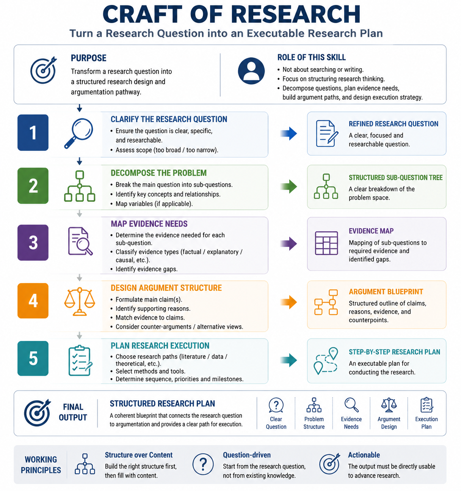
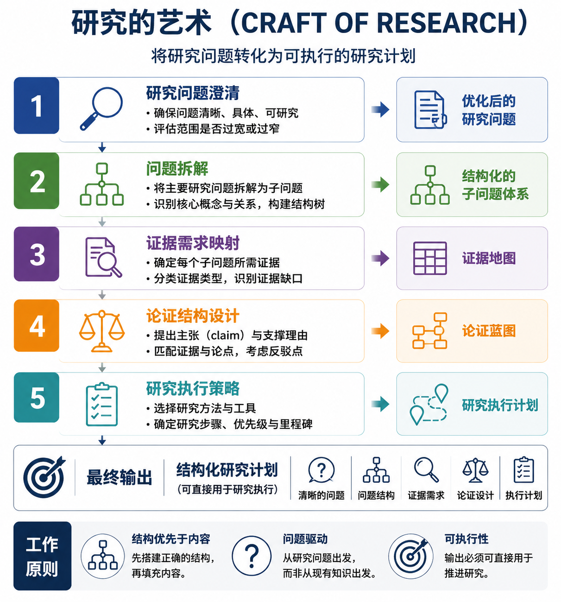

# Craft of Research

> A Socratic research-guide skill distilled from _The Craft of Research_ (5th Edition).

---

**Read this document in:**

- [**English**](#english)
- [**中文**](#中文)

---

<!-- ================================================================== -->
<!-- ENGLISH                                                                -->
<!-- ================================================================== -->

## <span id="english">English</span>

A Socratic research-guide skill derived from _The Craft of Research_ (5th Edition). **Research is not an assembly line for collecting facts — it is an invitation into an ongoing conversation.** The best answers do not end a dialogue; they give birth to new questions.

### What Is This

This is an AI skill — not a paper-writing tool, but a Socratic thinking partner. It works by asking questions until you see your own research more clearly:

- Who are you talking to, and what are they discussing?
- What can you contribute that no one else has?
- Does your argument hold? How do you convince your reader?
- What new questions does your research open up?

Works with any AI coding agent that supports custom skills — OpenCode, Claude Code, Codex, and similar tools.



### The Six Dimensions

| # | Dimension | Core Question |
|---|-----------|---------------|
| 1 | **Entering the Academic Conversation** | Who are you talking to, and what are they discussing? |
| 2 | **Finding Your Creative Angle** | What can you contribute that no one else has? |
| 3 | **Building Your Argument** | Does your argument hold? How do you convince your reader? |
| 4 | **Ethics and Social Responsibility** | Who might your research affect, and what are your responsibilities? |
| 5 | **Keep Going** | What new questions does your research open up? |
| 6 | **Writing and Presenting Your Argument** | How do you make your argument meaningful to others? |

Researchers can switch freely between dimensions — no fixed order, no turn limit.

### Workflow: From Dialogue to a Research Memo

The skill guides you through three phases. Dialogue exploration builds clarity; the innovation self-check confirms readiness; a structured research memo captures the result.

```
┌──────────────────────────────────────────────────────────┐
│           Phase A — Dialogue Exploration                 │
│                                                          │
│   Step 1 ── Define your problem ──────────── Dimension 1 │
│   Step 2 ── Validate your significance ───── Dimension 2 │
│   Step 3 ── Build your argument ──────────── Dimension 3 │
│   Step 4 ── Check ethics ────────────────── Dimension 4 │
│   Step 5 ── Open new questions ───────────── Dimension 5 │
│   Step 6 ── Verify you can say it ────────── Dimension 6 │
│              (optional, for writing/presenting)          │
└──────────────────────────────────────────────────────┬───┘
                                                       │
                                                       ▼
┌──────────────────────────────────────────────────────┴───┐
│         Phase B — Innovation Self-Check (5 steps)        │
│                                                          │
│   □ Step 1: Can I name the conversation I'm joining?    │
│   □ Step 2: Can I answer "So What?" at least 2 levels?  │
│   □ Step 3: Can I name my 2 weakest reasoning links?    │
│   □ Step 4: Can I restate my argument from an           │
│             opponent's perspective?                      │
│   □ Step 5: Can I say what new questions my research     │
│             opens up?                                    │
│                                                          │
│   Any "no" → return to the corresponding dimension.     │
└──────────────────────────────────────────────────────┬───┘
                                                       │
                                                       ▼
┌──────────────────────────────────────────────────────┴───┐
│         Phase C — Research Memo                          │
│                                                          │
│   A structured summary containing:                       │
│   ├─ Research question (the X/Y/Z statement)             │
│   ├─ Creative angle (agreement/disagreement/extension)   │
│   ├─ Argument skeleton (claim → reasons → evidence)      │
│   ├─ Potential challenges (weakest links + counterargs)  │
│   └─ Next questions (what this research opens up)        │
└──────────────────────────────────────────────────────────┘
```

The dialogue is **not** a linear form-filling exercise. You loop between steps, revisit earlier dimensions, and only move to Phase B when your thinking feels solid enough. The research memo is a natural byproduct — not the goal, but what emerges when the conversation has done its work.

### How to Use

Invoke the skill with the trigger command:

```
/craft-of-research
```

Or describe your need directly. The skill activates automatically on trigger phrases:

| Trigger | What happens |
|---------|-------------|
| "I want to do research but don't know where to start" | Full dialogue, beginning at dimension 1 |
| "How do I formulate a good research question?" | Focus on dimensions 1 and 2 |
| "What's innovative about my research?" | Focus on dimension 2 |
| "Help me clarify my argument" | Focus on dimension 3 |
| "Is my research meaningful?" | "So What?" deep cascade |
| "Are there ethical issues in my research?" | Focus on dimension 4 |
| "What can I do next?" | Focus on dimension 5 |
| "I'm stuck on writing / presenting" | Focus on dimension 6 |

**Language selection:** On startup, the skill uses the `question` tool to ask whether you prefer English or Chinese.

### Project Structure

```
.
├── skills/
│   ├── SKILL.md               # Thin shell: language selection only (~34 lines)
│   ├── SKILL-zh.md            # Full Chinese version (~716 lines)
│   └── SKILL-en.md            # Full English version (~720 lines)
├── examples/
│   ├── humanities-en.md           # Sample dialogue — humanities (English)
│   ├── humanities-zh.md           # Sample dialogue — humanities (中文)
│   ├── science-en.md              # Sample dialogue — science (English)
│   └── science-zh.md              # Sample dialogue — science (中文)
├── docs/superpowers/
│   ├── plans/                     # Implementation plans
│   └── specs/                     # Design specifications
└── README.md                      # This file
```

### Examples

The `examples/` folder contains sample dialogues showing the skill in action. Each file walks through all six dimensions with a realistic researcher profile.

| Discipline | Dialogue |
|------------|----------|
| **Science** — Environmental Microbiology: "Effects of agricultural management on soil microbial communities and carbon sequestration" | [science-en.md](examples/science-en.md) |
| **Humanities** — Cultural Studies / Memory Studies: "How second-generation Chinese immigrants construct cultural identity on social media" | [humanities-en.md](examples/humanities-en.md) |

### Source

This skill is distilled from **_The Craft of Research_** (5th Edition, University of Chicago Press) by Wayne C. Booth, Gregory G. Colomb, Joseph M. Williams, Joseph Bizup, and William T. FitzGerald — one of the most widely used guides to academic research and writing ever published.

### License

This project is for educational and research purposes only.

---

<!-- ================================================================== -->
<!-- 中文                                                                   -->
<!-- ================================================================== -->

## <span id="中文">中文</span>

基于 _The Craft of Research_（第五版）的苏格拉底式研究引导技能。**研究不是收集事实的流水线，而是进入一场持续对话的邀请。** 最好的答案不是结束对话，而是催生新的问题。

### 这是什么

这是一个 AI 引导技能（skill），不是帮你写论文的工具，而是一个苏格拉底式的对话伙伴。它的工作方式是通过提问帮你自己想清楚：

- 你在和谁对话？他们在讨论什么？
- 你能贡献什么别人没有的东西？
- 你的论点站得住吗？你拿什么说服读者？
- 你的研究打开了什么新问题？

适用于任何支持自定义技能的 AI 编程工具——OpenCode、Claude Code、Codex 等。



### 六大对话维度

| # | 维度 | 核心问题 |
|---|------|---------|
| 一 | **进入学术对话** | 你在和谁对话？他们在讨论什么？ |
| 二 | **找到你自己的切入点** | 你能贡献什么别人没有的东西？ |
| 三 | **把论证搭起来** | 你的论点站得住吗？你拿什么说服读者？ |
| 四 | **研究的伦理与社会责任** | 谁可能受你的研究影响？你有什么责任？ |
| 五 | **持续往前走** | 这个研究打开了什么新问题？ |
| 六 | **把你的论证写出来、讲出来** | 怎么让你的论证对别人有意义？ |

研究者可以在六个维度之间自由切换，没有固定顺序，没有轮次上限。

### Workflow：从对话到研究备忘录

技能通过三个阶段引导。对话探索建立思路清晰度；创新性自检确认就绪；结构化备忘录产出一份可归档的成果。

```
┌──────────────────────────────────────────────────────────┐
│           Phase A — 对话探索                             │
│                                                          │
│   Step 1 ── 定义问题（科学问题是什么？）─── 维度一        │
│   Step 2 ── 验证意义（为什么值得做？）──── 维度二        │
│   Step 3 ── 搭建论证（逻辑是否严谨？）─── 维度三        │
│   Step 4 ── 检查伦理 ─────────────────── 维度四        │
│   Step 5 ── 打开新问题 ──────────────── 维度五        │
│   Step 6 ── 验证可表达（可选）────────── 维度六        │
└──────────────────────────────────────────────────────┬───┘
                                                       │
                                                       ▼
┌──────────────────────────────────────────────────────┴───┐
│         Phase B — 创新性自检（五步）                     │
│                                                          │
│   □ Step 1: 我能说清自己在和谁对话吗？                  │
│   □ Step 2: 我能自然回答"So What?"至少2层？             │
│   □ Step 3: 我能说出自己最薄弱的2个推理环节？            │
│   □ Step 4: 我能从反对者的角度重述自己的论证？          │
│   □ Step 5: 我能说清自己的研究打开了什么新问题？        │
│                                                          │
│   任一"否"→ 回到对应维度继续深化                        │
└──────────────────────────────────────────────────────┬───┘
                                                       │
                                                       ▼
┌──────────────────────────────────────────────────────┴───┐
│         Phase C — 研究备忘录                             │
│                                                          │
│   一份结构化摘要，包含：                                 │
│   ├─ 研究问题（X/Y/Z 三句式）                           │
│   ├─ 创造性切入点（同意/异议/扩展）                     │
│   ├─ 论证骨架（主张 → 理由 → 证据）                     │
│   ├─ 潜在挑战（最薄弱环节 + 反方观点）                  │
│   └─ 下一步问题（这个研究打开了什么）                   │
└──────────────────────────────────────────────────────────┘
```

对话**不是**线性填表。你可以在各步之间来回跳转，随时回到前面的维度重新审视，直到思路足够清晰再进入 Phase B。研究备忘录是对话自然产生的副产品——不是目标，而是对话完成时浮现的东西。

### 怎么用

在支持的 AI 工具中触发命令：

```
/craft-of-research
```

或直接描述你的需求——技能会根据触发词自动激活：

| 触发 | 效果 |
|------|------|
| "我要做研究但不知道从何下手" | 完整对话，从维度一开始 |
| "如何提出好的研究问题" | 聚焦维度一、二 |
| "我的研究有什么创新点" | 聚焦维度二 |
| "帮我理清论证" | 聚焦维度三 |
| "我的研究有没有价值" | "So What?" 深度级联 |
| "我的研究有没有伦理问题" | 聚焦维度四 |
| "接下来还可以做什么" | 聚焦维度五 |
| "我的表达/写作卡住了" | 聚焦维度六 |

**语言选择：** 启动时 skill 会通过 `question` 工具让你选择中文或英文。

### 项目结构

```
.
├── skills/
│   ├── SKILL.md               # 瘦壳：语言选择入口（约 34 行）
│   ├── SKILL-zh.md            # 中文完整版（约 716 行）
│   └── SKILL-en.md            # 英文完整版（约 720 行）
├── examples/
│   ├── humanities-en.md           # 示例对话 — 文科（English）
│   ├── humanities-zh.md           # 示例对话 — 文科（中文）
│   ├── science-en.md              # 示例对话 — 理科（English）
│   └── science-zh.md              # 示例对话 — 理科（中文）
├── docs/superpowers/
│   ├── plans/                     # 实现计划
│   └── specs/                     # 设计文档
└── README.md                      # 本文件
```

### 示例

`examples/` 文件夹包含技能的实际对话示例，每份示例围绕一个真实研究者画像跑通全部六个维度。

| 学科 | 对话 |
|------|------|
| **理科** — 环境微生物学："不同农业管理措施对土壤微生物群落与碳固定的影响" | [science-zh.md](examples/science-zh.md) |
| **文科** — 文化研究 / 记忆研究："中国移民二代如何在社交媒体上建构文化身份" | [humanities-zh.md](examples/humanities-zh.md) |

### 来源

本技能提炼自 **《The Craft of Research》**（第五版，芝加哥大学出版社），作者 Wayne C. Booth、Gregory G. Colomb、Joseph M. Williams、Joseph Bizup 和 William T. FitzGerald。这是学术界最经典的研究方法论之一，四十多年来帮助了无数研究者学会如何提出问题、构建论证、加入学术对话。

### 许可证

本项目仅用于教育和研究目的。
